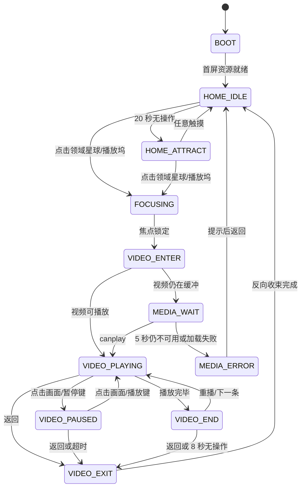

# 是石科技领域视频互动台｜图一交互与动效规范 v1.0

视觉基准：`图一_轨道中枢_选定视觉稿_v1.png`  
目标设备：Xiaomi Pad 8 Pro，横屏 3:2  
核心任务：用户触碰任一领域星球后，以一次操作进入对应视频；视频结束或主动返回后，回到星图继续选择。

## 1. 体验原则

1. **一触即播**：领域星球不是信息卡片。点击后先完成短促的聚焦反馈，随后直接展开并播放视频，不要求再次确认。
2. **中心稳定、外围响应**：METASTONE 核心始终是视觉锚点；七个领域星球负责选择，右下播放坞负责显示当前焦点和提供等价的播放入口。
3. **动效解释空间关系**：动效用于说明“领域星球被选中，并从星图进入影片”，不做无意义的炫技转场。
4. **公共展项可自恢复**：无人操作时进入吸引模式；视频暂停后长期无人操作会自动回到总览，避免设备停留在失效状态。
5. **触摸优先**：不依赖 hover、右键、长按或复杂手势。主要路径只使用点击与进度拖动。

## 2. 页面状态机

建议前端状态枚举：

- `BOOT`
- `HOME_IDLE`
- `HOME_ATTRACT`
- `FOCUSING`
- `VIDEO_ENTER`
- `MEDIA_WAIT`
- `VIDEO_PLAYING`
- `VIDEO_PAUSED`
- `VIDEO_END`
- `VIDEO_EXIT`
- `MEDIA_ERROR`

## 3. 首页交互逻辑

### 3.1 首次进入

- 默认焦点为 `01 大模型`，右下播放坞同步显示 `01/07`、中英文名称、时长与播放按钮。
- 不自动播放视频，不自动出声。
- 星图完成一次 1.6 秒入场后，立即可触摸；不能为了等动画而阻塞操作。
- 如果用户本次会话已播放过领域视频，返回总览时保留最后一个领域为焦点。

### 3.2 点击领域星球

一次点击完成完整路径：

1. `pointerdown`：星球压缩至 `0.96`，外环亮度提升，80 ms 内给出反馈。
2. `pointerup`：星球回弹并放大至 `1.08`；其他星球降至 68% 亮度。
3. 核心至目标星球的连接线被点亮，右下播放坞更新为所选领域。
4. 约 260 ms 后开始视频门户展开；总计约 800 ms 内进入影片。
5. 视频在用户本次点击手势链路中启动，默认音量 70%。若浏览器阻止有声播放，则先静音播放并显著显示“开启声音”。

### 3.3 点击已聚焦星球或播放坞

- 与点击其他领域相同，直接进入并播放当前视频。
- 播放坞是辅助入口，不增加确认层。

### 3.4 点击 METASTONE 中心核心

- 作用为“回到领域总览 / 视角复位”，不绑定第八条视频。
- 停止吸引模式，轨道和节点恢复标准位置，焦点回到最近播放领域。
- 首页已经处于标准总览时再次点击，只产生一次轻微核心呼吸反馈，不跳页。

### 3.5 快速连续点击

- 视频门户开始展开前，采用“最后一次触摸优先”：新的领域选择覆盖旧选择，并重新计算连接线与播放坞内容。
- 门户展开后锁定输入约 640 ms，防止重复创建播放器或同时加载多个视频。
- 不使用固定 300 ms 延迟来判断双击；本产品没有双击功能。

## 4. 首页吸引模式

- 首页连续 20 秒无操作，进入 `HOME_ATTRACT`。
- 每 6 秒依次聚焦一个领域：星球轻微放大、连接线点亮、播放坞内容切换；**只演示选择，不自动播放视频**。
- 任意触摸在 80 ms 内立即终止吸引模式，并把控制权交给用户。
- 背景星尘、行星自转和轨道能量流在 `HOME_IDLE` 与 `HOME_ATTRACT` 均可持续，但幅度必须低于交互反馈。

## 5. 视频进入逻辑

### 5.1 门户转场

- 选中星球保持为视觉来源点，向屏幕四周扩张为视频画面。
- 推荐使用共享元素转场：星球边界从圆形逐渐扩展为全屏矩形，视频 poster/首帧始终位于其内部。
- 其他星球、轨道和首页文字在 220–280 ms 内退场；禁止先切黑再出现视频。
- 在点击发生时立即调用目标视频的 `load()`；门户展开与媒体缓冲并行执行。

### 5.2 缓冲与失败

- 0–1.5 秒：保持 poster/领域视觉，不显示加载提示。
- 超过 1.5 秒：在画面中心显示低干扰环形加载指示。
- 超过 5 秒或触发媒体错误：显示“视频暂未就绪”，提供“返回总览”与“重试”。默认 3 秒后回到星图。
- 加载失败不得留下黑屏或冻结的全屏层。

## 6. 视频播放交互

### 6.1 播放器默认状态

- 入场完成后控制栏显示 2.8 秒；持续播放且无操作时淡出。
- 单击视频画面：播放与暂停切换，同时显示控制栏。
- 暂停时控制栏保持可见，画面中心显示大号播放按钮。
- 不启用双击快进、上下滑音量等隐藏手势，避免公共触控场景误触。

### 6.2 控制项

- 左侧：返回总览、`序号 / 07`、中英文领域名称。
- 中间：上一领域、播放/暂停、下一领域。
- 右侧：当前时间、可拖动进度、总时长、声音开关。
- 应用本身已运行在横屏全屏/展项模式时，不再显示冗余的浏览器全屏按钮。

### 6.3 进度拖动

- 按住进度滑块时暂时暂停更新进度动画，显示目标时间。
- 松手后跳转；如果拖动前正在播放，则继续播放；如果拖动前已暂停，则保持暂停。
- 拖动过程中不触发控制栏自动隐藏。

### 6.4 上一条 / 下一条

- 当前画面在 220 ms 内降至 25% 亮度，同时更新领域名称。
- 下一条 poster 淡入；媒体就绪后开始播放。
- `01` 的上一条循环到 `07`，`07` 的下一条循环到 `01`。

### 6.5 播放结束

- 保留最后一帧 600 ms，再覆盖 35% 深蓝遮罩。
- 显示三个明确动作：`重播`、`下一领域`、`返回总览`。
- 8 秒无操作自动返回总览，并保持刚刚播放的领域为焦点。

### 6.6 长时间暂停

- 暂停状态连续 90 秒无操作，显示 10 秒回归倒计时。
- 倒计时期间任意触摸立即取消回归。
- 倒计时结束执行 `VIDEO_EXIT`，防止公共设备长期停留在暂停画面。

## 7. 返回星图

- 点击返回、系统返回键或结束页“返回总览”，均执行同一条反向转场。
- 视频画面收束回当前领域星球位置；首页轨道、其他星球和播放坞同步恢复。
- 视频在收束开始时暂停，在 180 ms 内音量平滑降为 0，避免突然断音。
- 反向转场完成后卸载视频画面，但保留当前领域 poster 和基础 metadata 缓存。

## 8. 动效时序表

| 动作 | 时长 | 缓动 | 说明 |
|---|---:|---|---|
| 首屏标志与星图入场 | 1,600 ms | `cubic-bezier(.22,1,.36,1)` | 可被用户操作打断 |
| 触摸压下 | 80 ms | `ease-out` | 缩放至 0.96 |
| 星球聚焦回弹 | 360 ms | `cubic-bezier(.16,1,.3,1)` | 放大至 1.08 |
| 连接线描边点亮 | 420 ms | `ease-out` | 与聚焦并行 |
| 播放坞内容切换 | 240 ms | `cubic-bezier(.2,0,0,1)` | 旧内容上移淡出，新内容下移淡入 |
| 视频门户展开 | 640 ms | `cubic-bezier(.22,1,.36,1)` | 共享元素转场 |
| poster → 视频首帧 | 220 ms | `ease-out` | 禁止黑场 |
| 控制栏进入 / 退出 | 180 / 220 ms | `ease-out / ease-in` | 仅 opacity + translateY |
| 上一条 / 下一条切换 | 320 ms | `ease-in-out` | 不做整页滑动 |
| 视频返回星图 | 520 ms | `cubic-bezier(.4,0,.2,1)` | 比进入略快 |
| 当前星球呼吸 | 4,800 ms 循环 | `ease-in-out` | 亮度变化不超过 12% |
| 轨道能量流 | 18–24 s 循环 | `linear` | 只在细线中运动 |
| 背景星尘漂移 | 48–72 s 循环 | `linear` | 位移不超过屏幕宽度 1.2% |

## 9. 分层动画规则

### 背景层

- 深空底图保持稳定；星尘只有极慢漂移和极小景深变化。
- 不使用大范围闪烁，避免干扰文字与视频入口。

### 轨道层

- 轨道本体静态，只有少量能量点沿路径低速流动。
- 选择领域时，仅核心至目标节点的路径升亮；其他轨道不同时抢亮。

### 星球层

- 非焦点星球保持轻微自转，周期 60–120 秒。
- 当前焦点只使用柔和呼吸和环形扫描，不使用频繁脉冲或大幅上下浮动。
- 标签始终保持正向，不随星球纹理旋转。

### UI 层

- 文字切换采用 8–12 px 的短距离位移与透明度，不做大幅飞入。
- 播放按钮光环每 4.8 秒呼吸一次；用户触摸后立即停止循环并转入反馈动画。

## 10. 触摸与可用性约束

- 可见星球之外增加透明命中区；每个节点的最小有效触摸范围不小于 96 × 96 CSS px。
- 所有主要按钮最小触摸范围不小于 64 × 64 CSS px，按钮间距不小于 16 px。
- 触摸反馈必须在 100 ms 内出现。
- 文字和图标不承担唯一点击区域，整个星球或按钮容器均可触摸。
- 禁止页面滚动、双指缩放、文本选择和浏览器长按菜单。

## 11. 性能与降级

- 目标为 60 fps；关键转场只动画 `transform` 与 `opacity`。静态毛玻璃可以保留，但不连续动画 `blur`、`box-shadow` 或大面积滤镜。
- 只保留当前、上一条、下一条视频的 metadata/poster；不同时解码七条视频。
- 视频切换后及时释放旧媒体资源，防止长时间运行后内存增长。
- 页面隐藏、锁屏或应用切后台时立即暂停视频；恢复后保持暂停并显示控制栏。
- `prefers-reduced-motion` 或低性能模式下：取消星尘漂移、星球自转和圆形扩张，统一改为 180 ms 淡入淡出。
- 动画帧率连续低于 45 fps 时，自动关闭背景粒子与轨道流光，保留选择和门户转场。

## 12. 与当前程序的落地映射

当前程序已有领域数据、视频层、播放/暂停、上一条/下一条、进度和返回能力。改造时建议：

- 将 `activeId` 拆为 `selectedId` 与 `viewState`，首页默认 `selectedId = "large-models"`。
- 将当前“点击节点立即挂载播放器”改为：`FOCUSING → VIDEO_ENTER → VIDEO_PLAYING`。
- 把底部七格导航替换为图一右下的单领域播放坞。
- 领域节点改为真实星球可视层 + 独立透明命中层，避免用文字位置充当点击区域。
- 视频层增加 poster、缓冲、结束页、媒体错误和暂停超时状态。
- 使用共享元素 ID 连接所选星球与视频门户；不支持共享元素转场时回退为缩放 + 淡入。

## 13. 验收标准

1. 从点击任意星球到看见视频画面，视觉响应小于 100 ms，正常缓存下总进入时间不超过 900 ms。
2. 七个星球均能一触进入正确视频，序号、中文名、英文名和文件映射一致。
3. 快速连续点击不会叠加播放器、串台或出现黑屏。
4. 播放、暂停、进度、上一条、下一条、声音、返回和播放结束均有完整状态。
5. 无操作吸引模式不会自动出声或自动播放。
6. 运行 2 小时后无明显内存持续增长，主要转场在目标设备上保持接近 60 fps。
7. 媒体缺失、加载超时或浏览器拒绝有声播放时，用户始终有明确可恢复路径。
